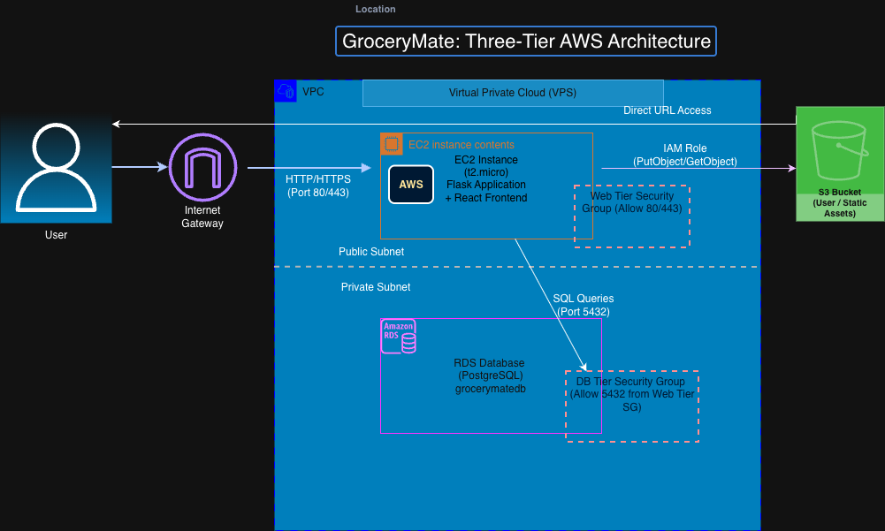

# 🛒 GroceryMate: Cloud Infrastructure & Deployment

## Table of Contents

1.  🏁 [Overview & Context](#overview--context)
2.  🏗️ [Cloud Architecture & Component Visualization](#cloud-architecture--component-visualization)
3.  🔐 [Key Architectural Decisions](#key-architectural-decisions)
4.  💰 [Cost Optimization](#cost-optimization)
5.  ⚙️ [Deployment & Installation](#deployment--installation)
6.  🔮 [Future Enhancements](#future-enhancements)

---

## 1. 🏁 Overview & Context

This project documents the successful deployment and cloud infrastructure design for the **GroceryMate** e-commerce platform. Developed as part of the **Cloud Track program at Masterschool's Software Engineering Bootcamp**, this repository serves as a practical demonstration of **Cloud Engineering** and **Infrastructure as Code (IaC)** skills.

My primary goal was to transform this application from a local environment into a robust, repeatable, and securely configured system on **Amazon Web Services (AWS)**.

### Key Skills Demonstrated:

* **Infrastructure as Code (IaC):** Full definition and management of all AWS resources using **Terraform**.
* **Three-Tier Architecture:** Implementation of a standard, secure application structure.
* **Cloud Migration:** Successful migration of local data dependencies to managed cloud services (**AWS RDS** and **AWS S3**).
* **Security:** Implementation of fine-grained access control using **VPC** and **Security Groups**.

### Core Technologies:
* **Application:** Python (Flask), React Frontend
* **Containerization:** Docker
* **IaC:** Terraform
* **AWS Services:** EC2, RDS (PostgreSQL), S3, VPC, Security Groups, IAM.

## 2. 🏗️ Cloud Architecture & Component Visualization



## 3. 🔐 Key Architectural Decisions

The infrastructure was designed with security, separation of concerns, and cost-effectiveness in mind, aligning with AWS best practices. This section explains the "why" behind key component choices.

### 3.1. Data Security and Isolation (VPC & Security Groups)

* **Decision:** Placing the RDS PostgreSQL instance in a **Private Subnet** and exposing it only through its Security Group (SG).
* **Rationale:** This prevents direct exposure of the database to the public internet, mitigating SQL injection and brute-force attacks. Access to the DB (Port 5432) is only permitted from the **EC2 instance's SG**.

### 3.2. Choosing Managed Database (AWS RDS)

* **Decision:** Utilizing **AWS RDS** for PostgreSQL instead of installing PostgreSQL directly on the EC2 instance.
* **Rationale:** RDS is a fully managed service that automatically handles routine operational tasks such as **patching, backups, and high availability**. This significantly reduces the administrative burden compared to self-managing the database.

### 3.3. File Storage Strategy (S3 vs. EC2 Disk)

* **Decision:** Migrating user avatars and static assets to an **S3 Bucket** (e.g., `grocerymate-jennys-avatars`).
* **Rationale:** S3 offers **eleven nines (99.999999999%) durability** and **unlimited scalability**, eliminating the risk of data loss if the EC2 instance fails and ensuring assets are highly available.

### 3.4. Secure Access Control (IAM Role)

* **Decision:** Assigning an **IAM Role** to the EC2 instance instead of embedding AWS credentials in the application code.
* **Rationale:** The EC2 instance assumes this role to securely communicate with other AWS services (like S3) without ever storing long-term secret keys on the server, strictly adhering to the principle of **least-privilege**.


## 4. 💰 Cost Optimization

Since this repository represents a learning environment rather than a production setup, cost management was a critical architectural consideration. The following strategies were implemented to minimize idle charges:

### 4.1. Stop/Start Strategy for Core Resources

* **Action:** The EC2 instance and the RDS Database are configured with a **manual Stop/Start schedule** to prevent charges during off-hours (e.g., nights and weekends).
* **Rationale:** By manually stopping the resources when not in use, we maintain the configuration (IP, data) while minimizing compute and storage costs associated with running instances. This strategy is ideal for development and testing phases.

### 4.2. Instance Sizing

* **Action:** Utilized **t2.micro** instance type for EC2 and the smallest available instance size for RDS (e.g., db.t3.micro).
* **Rationale:** The t2/t3 burstable performance classes offer sufficient power for testing the application's core functionality while remaining within the Free Tier limits or incurring minimal hourly charges.

### 4.3. Leveraging S3 for Static Content

* **Action:** Using S3 for static assets (avatars) instead of storing them on the EC2's Elastic Block Store (EBS).
* **Rationale:** S3 is highly cost-effective and scalable for storing large amounts of infrequently accessed data compared to the higher per-GB cost of EBS volumes.

### 4.4. Production Cost Strategy & Availability

If this were a commercial production environment requiring high availability (HA) and a robust Service Level Agreement (SLA), the cost strategy would pivot to:

* **HA & Scalability:** Implementing an **Application Load Balancer (ALB)** and an **Auto Scaling Group (ASG)** across multiple Availability Zones (AZs). While this increases the base cost, it is necessary to guarantee uptime and handle fluctuating traffic demand efficiently (Pay-as-you-grow model).
* **Long-Term Savings:** Utilizing **Reserved Instances (RIs)** or **Savings Plans** for the EC2 and RDS components. This commits the company to a 1 or 3-year term in exchange for a significant discount (up to 70%), ensuring cost-effective operation for predictable long-term workloads.


## 5. ⚙️ Deployment & Installation

The entire infrastructure, including the VPC, Subnets, EC2 instance, RDS database, and S3 bucket, is provisioned using **Terraform**.

### 5.1. Prerequisites

Ensure you have the following tools installed and configured:
* **Terraform (v1.x.x):** Download the CLI from the [Terraform Downloads Page](https://developer.hashicorp.com/terraform/downloads).
* **AWS CLI:** Download and configure the command-line interface from the [AWS CLI Installation Guide](https://docs.aws.amazon.com/cli/latest/userguide/install-cliv2.html).
* **Docker:** Used for application containerization. Get started at [Docker's official website](https://www.docker.com/get-started).

### 5.2. Deployment Steps

Follow these steps to deploy the infrastructure:

#### Step 1: Clone the Repository

Clone this repository and navigate to the Terraform directory (`infrastruktur`):

```bash
git clone https://github.com/EugeniaBel/AWS_grocery/tree/version2/backend
cd AWS_grocery/infrastruktur

```

#### Step 2: Configure AWS Credentials

Ensure your AWS credentials are set up. Terraform will automatically use the credentials configured by the AWS CLI or environment variables.

```bash

aws configure # Or export AWS_ACCESS_KEY_ID=...
```

#### Step 3: Initialize Terraform
Initialize the working directory to download necessary provider plugins and backend configuration.

```bash

terraform init
```

#### Step 4: Review and Plan
Review the infrastructure plan to ensure Terraform will create the expected resources (VPC, RDS, EC2, S3).

```bash

terraform plan -out tfplan
```

#### Step 5: Apply Infrastructure
Apply the plan to provision the resources on AWS. Confirm the action by typing yes when prompted.

```bash

terraform apply "tfplan"
```

#### Step 6: Access the Application
Once the deployment is complete, Terraform will output the public address of the EC2 instance. Use this address to access the running application:

```bash

# Example Output:
# public_ip = "18.156.129.244" 
Navigate to http://<PUBLIC_IP_ADDRESS>:3000 in your web browser.
```

### 5.3. Teardown (Cleanup)
To completely destroy all created AWS resources and avoid incurring further costs, use the destroy command:

```bash

terraform destroy
```


## 6. 🔮 Future Enhancements

While the current setup successfully demonstrates the core principles of cloud migration and IaC, several enhancements are planned to transition this architecture into a highly scalable and robust production-ready system.

### 6.1. High Availability and Scalability

* **Implement Auto Scaling Group (ASG) and Application Load Balancer (ALB):** Replace the single EC2 instance with an ASG fronted by an ALB. This would distribute traffic across multiple EC2 instances in different Availability Zones (AZs) to ensure high availability and automatically scale compute capacity based on traffic demand.
* **RDS Multi-AZ Deployment:** Enable Multi-AZ for the RDS instance to provide automatic failover and enhanced durability in case of an AZ outage.

### 6.2. Automation and CI/CD

* **Launch Template Automation:** Create a dedicated Launch Template for the ASG to streamline the deployment process and avoid manual configuration steps (as initially performed in the learning phase).
* **Introduce CI/CD Pipeline:** Implement a Continuous Integration/Continuous Deployment (CI/CD) pipeline using services like AWS CodePipeline or GitHub Actions to automate the build, test, and deployment of application code changes.

### 6.3. Serverless Integration

* **Event-Driven Invoice Generation:** Integrate a serverless workflow to decouple processes, such as:
    * **Trigger:** An order confirmation event.
    * **Action:** AWS Lambda function invoked to generate an invoice.
    * **Storage:** Store the generated invoice PDF in S3. This enhances modularity and cost-efficiency for asynchronous tasks.

    